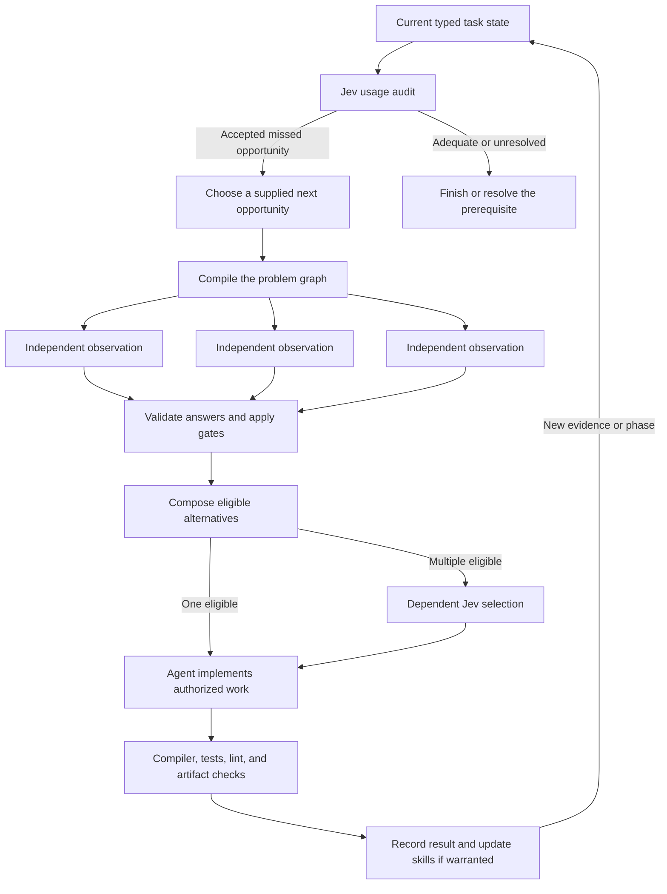

# How Jeva is built with Jev

Jeva's development uses the same pattern that the project provides to other programs: represent the current problem explicitly, ask Jev for bounded semantic observations, compose those observations in code, and use the result to guide the next development step. The agent writes the TypeScript and documentation. Jev returns declared labels and probabilities. Compilers, tests, linters, and repository tools establish their own observable facts.

“Builds itself” describes this development feedback loop. It does not mean Jev generates arbitrary source code, verifies its own correctness, trains itself, or works unattended between conversations.

## Represent the actual problem

There are two complementary state types. `ReasoningState` records what work remains and whether a useful Jev opportunity has been missed. `ProblemState` describes an actual decision through an objective, requirements, and candidate alternatives. Both can be loaded from validated JSON; the TypeScript controller is compiled before it executes them.

```ts
type ProblemState = {
  objective: string;
  requirements: { id: string; statement: string }[];
  candidates: { id: string; description: string }[];
};

type ReasoningState = {
  objective: string;
  requestedMethod: string;
  completed: string[];
  unresolved: string[];
  opportunities: { id: string; description: string }[];
};
```

The actual schemas are in [problem-state.ts](../examples/support/problem-state.ts) and [reasoning-state.ts](../examples/support/reasoning-state.ts). IDs must be unique within their sets; required text cannot be blank. Supplied state is limited to 64,000 bytes. A decision can contain at most 127 candidate/requirement observations plus one selection node, matching the runner's 128-node cap.

The type represents a problem's structure; natural-language statements supply the semantic content Jev evaluates. Requirements are conjunctive in the current example: every requirement must pass for a candidate to become eligible. Candidate selection is a choice among eligible alternatives. More elaborate AND/OR proofs need explicit composition rules and an appropriate verifier.

## The development loop



The audit asks whether a _useful semantic decision_ remains unmodeled. It does not ask whether the agent has made enough calls to look busy. Its second question chooses among opportunities already represented in the state. A single opportunity can be selected deterministically after the audit; missing or uncertain results remain unresolved. The controller does not run the selected action automatically.

The decision graph builds a question for each candidate/requirement pair and evaluates all independent pairs together. Code admits only candidates whose required observations pass the gate with the `supports` label. If one candidate remains, there is no reason to ask a second model question. If several remain, the next question receives only those eligible choices. If none remain, the result is review.

For adaptive problems, [bounded recursive search](../skills/jev-decision/references/recursive-spaces.md) applies the same process to successive frontiers. A caller-supplied generator proposes new subproblems; the controller tracks paths, depth, node and call limits, and bounded evaluation concurrency. Parallel execution does not imply statistically independent model errors.

## A real development decision

The [development-problem.json](development-problem.json) input was created for the request to explain and improve Jeva's own development process. It compares three descriptions against three requirements: represent explicit task state, improve from feedback, and distinguish semantic judgment from implementation verification.

Run the compiled program with the actual state:

```sh
npm run jev:decide -- --state docs/development-problem.json
```

In the recorded live run, the gate required winning probability at least 0.90 and winner/runner-up margin at least 0.20:

| Candidate description                    | Explicit state   | Feedback         | Honest boundary          | Code's outcome          |
| ---------------------------------------- | ---------------- | ---------------- | ------------------------ | ----------------------- |
| Autonomous model authorship story        | Contradicts 1.00 | Contradicts 0.93 | Review: contradicts 0.88 | Ineligible              |
| Compiled feedback loop                   | Supports 1.00    | Supports 1.00    | Supports 0.98            | Sole eligible candidate |
| Typed static report without improvements | Supports 1.00    | Contradicts 1.00 | Supports 0.99            | Ineligible              |

Nine observations ran in one request. The controller selected the sole eligible description without another model call. The agent then used that design for this writeup and the current-state workflow changes. The model judged supplied descriptions; it did not prove the code implements them. Reported probabilities, including 1.00, are rounded model estimates.

An earlier live usage audit found a missed opportunity at 0.98 and selected `compiled_design` at 1.00. Acting on it produced a two-request chain: nine parallel requirement checks, then selection between two eligible architectures. A separate instruction-excerpt audit returned four probabilities below its 0.90 gate; those stayed in review. See [the evaluation record](skill-evaluation.md) for the observations and their limits.

## Release loop: executed, blocked, and narrowed

During the first npm release preparation, the agent represented the current work as a validated reasoning-state snapshot. The network attempt failed; approval review then blocked sending that private progress snapshot to the gateway. That audit has no semantic result and no probability. It did not select an opportunity or establish adequate coverage.

A separate, approved evaluation sent only the generic authored descriptions in [release-problem.json](release-problem.json), not the blocked snapshot. Run it with:

```sh
npm run jev:decide -- --state docs/release-problem.json
```

The compiled graph evaluated two explanatory alternatives against three requirements: supplied-report scope, uncertainty, and cooperative cancellation. Six independent observations shared one request. The bounded explanation received `supports` at 1.00 for each requirement; the guarantee-based explanation received `contradicts` at 1.00 for each. All six passed the existing 0.90 probability / 0.20 margin gate. Code selected the sole eligible explanation without another call. These are rounded model observations on deliberately contrasting descriptions, not a whole-README audit or accuracy benchmark.

The consuming action was to retain the README's unknown-weather fallback and probability caveat, link the async cancellation contract, and record the narrower scope here. The skill's reasoning-loop instructions now explicitly prevent a narrower substitute evaluation from marking a blocked current-state audit completed. Deterministic integration checks separately passed all 46 tests, strict Oxlint, formatting, TypeScript compilation, and Effect diagnostics over 24 of 24 source files. Three mission branches were integrated with explicit merge commits. Neither those tool results nor publication permission came from Jev.

For reproducibility, keep the distinction between the input snapshot, attempted invocation, accepted narrower observation, consuming change, and independent verification. A blocked call is part of the record, not an excuse to invent an audit result.

## When Jev is used

Use Jev for the semantic parts of the actual problem: whether supplied evidence supports a claim, whether a described candidate covers a requirement, which known category a message fits, whether a useful semantic opportunity remains, or which already-eligible description best matches an objective. Model these observations in a typed program and retain their state paths and outputs.

Use retrieval or the agent to produce missing context and candidate descriptions. Use code for counts, comparisons, graph planning, gates, resource limits, exact validation, and forwarding results. Use compilers and tests for executable behavior, Git for commit and remote state, and the user's instructions for authorization. Do not ask Jev to approve an external action or manufacture proof of a program's correctness.

If an opportunity cannot yet be expressed as a finite judgment, identify the missing evidence, candidate set, or decomposition. Fill that prerequisite, update the state, and reconsider. This keeps the buildout focused on expressing more of the real problem rather than replacing it with a canned demonstration.

## Improvements made from this process

The first evidence-check workflow used sequential calls and initially passed empty failed-call output into a gate. Invocation guidance now separates errors from semantic insufficiency, preserves IDs, and uses bounded independent execution.

The initial development examples embedded fixed state. Feedback exposed that replaying them could not audit the agent's current work. Both audit and decision workflows now accept `--state` files. The generic decision fixture returns synthetic `insufficient` for external state, so an offline run cannot fabricate semantic support. Only live evaluations produce actual model judgments.

Long inline shell programs made the workflow hard to inspect and reuse. Short npm commands now compile and execute checked-in programs. The normal `jev` skill now leads with the local CLI, typed graph, current-state audit, and invocation contracts; direct-SDK material is a conditional reference.

Research also delayed committing working increments. The agent instructions now require coherent validated commits during the authorized research workflow. Git facts are checked directly; a semantic audit cannot stand in for a successful push.

These are source and workflow improvements. There is no model retraining or claim that higher confidence proves better accuracy. Future changes follow [the self-improvement procedure](../skills/jev-decision/references/self-improvement.md): observed failure, hypothesis, focused intervention, appropriate validation, and an honest account of what improved.

## Short commands and evidence limits

```sh
npm run jev:audit -- --state task.json
npm run jev:decide -- --state problem.json
npm run jev:search
npm test
```

The `jev:*` commands call the configured gateway. Their `demo:*` counterparts exercise offline fixtures and do not measure semantic accuracy. A state file is sent to the model in live mode: include only appropriate task context, never credentials or unrelated private material. An earlier full-file transfer was blocked by approval review; the narrower follow-up used only non-sensitive excerpts and explicitly reduced its coverage claim.

Typed compilation verifies language-level consistency. Offline tests verify exercised control-flow properties, including batching, gates, failure handling, and limits. Live calls verify integration and provide semantic observations. Formal invariants require their stated assumptions, and a complete solution requires its own verifier. None of these alone establishes that every future model judgment or problem decomposition is correct.
